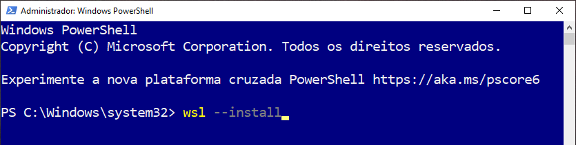
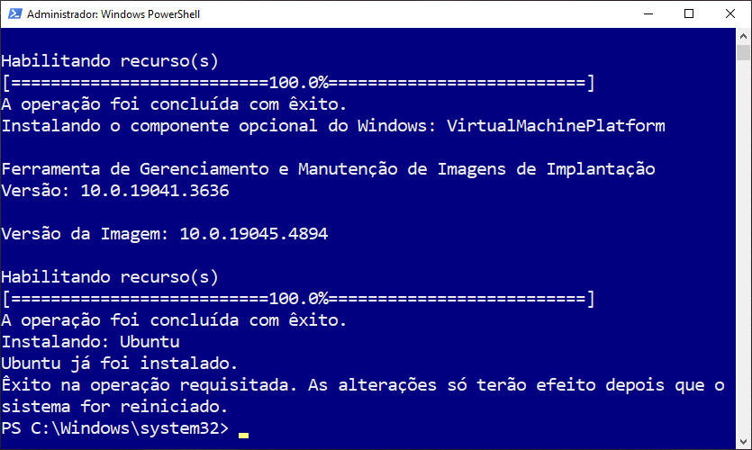
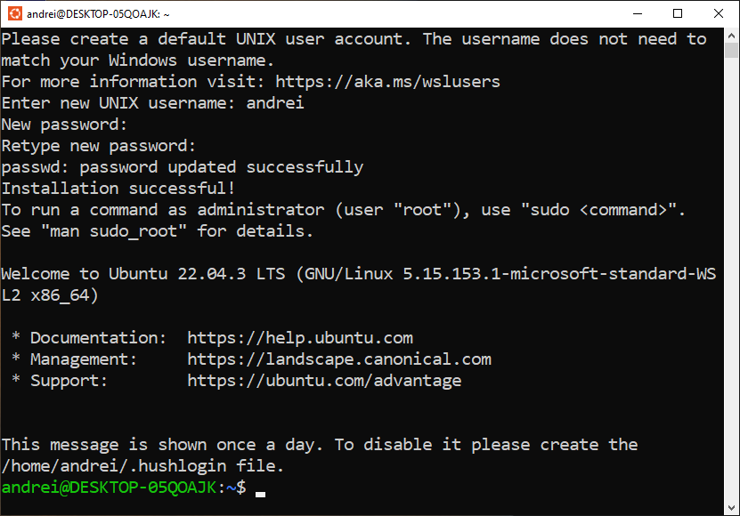
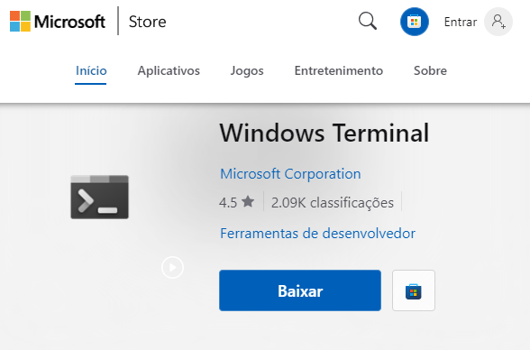
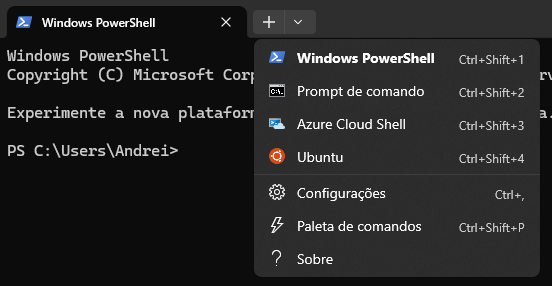
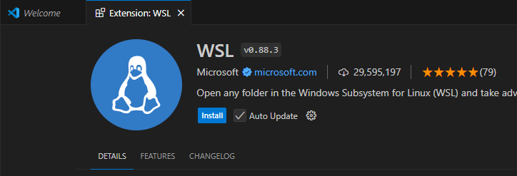

## 1. Introdução

---
Para configurar o ambiente de desenvolvimento no Windows, precisamos ter o WSL instalado. Neste tutorial nós iremos detalhar como fazer isso, além de sugerir algumas outras ferramentas adicionais para otimizar o trabalho.

## 2. Instalando o WSL 2

---
Os passos descritos abaixo são baseados na documentação oficial da Microsoft, sendo necessária a execução de apenas um comando para desencadear o processo automático. O requisito para a instalação é ter o Windows 11, ou o Windows 10 na versão 20H1 e superior (Build 19041 e superior).

#### Passo 1: Habilitar recursos e instalar Ubuntu
Com o PowerShell (ou o Prompt de Comando do Windows) aberto no modo de administrador, executar o comando `wsl --install`. Esse comando habilitará os recursos necessários para executar o WSL e irá instalar a distribuição Ubuntu do Linux. Para que a instalação seja concluída será necessário **_reiniciar o computador_**.

#### Passo 2: Criar usuário no Ubuntu

Após reiniciar o computador, caso uma janela de terminal do Ubuntu não abra automaticamente, vá no menu iniciar e busque por "Ubuntu". Clicando no ícone será aberto o terminal da distribuição. Após aberto, a distribuição será inicializada, solicitando a criação de um usuário e senha. _Obs._: ao digitar a senha, nada será exibido. Isso é um recurso de segurança padrão do terminal.

### 2.1 Instalando o Windows no Terminal
Por fim, é recomendável a instalação do Windows Terminal, que é uma interface moderna, unificada, e customizável para vários shells. Ele irá facilitar a nossa vida na hora de colar e executar os comandos de múltiplas linhas. No Windows 11 ele já está presente nativamente, mas no Windows 10 é preciso instalá-lo via Microsoft Store.

Ao abrir o Windows Terminal, o PowerShell será iniciado por padrão, mas você pode selecionar o terminal do Ubuntu clicando na seta `∨`, ao lado do botão de `+`:

### 2.2 Bônus
Para ter uma experiência mais integrada com o WSL no VScode, você deve instalar a extensão chamada WSL.

# FIM
